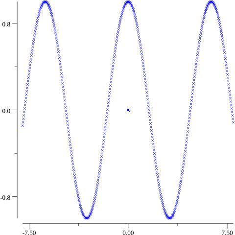
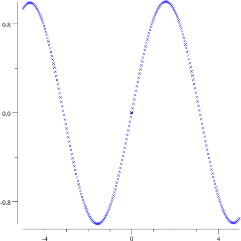
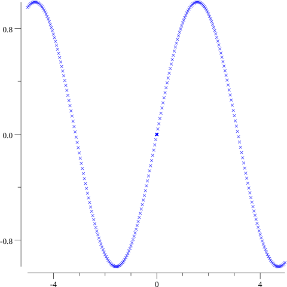
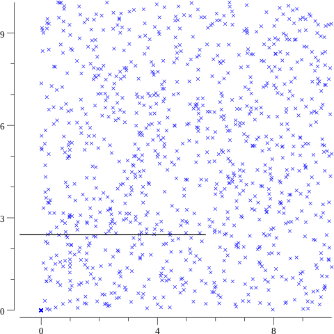
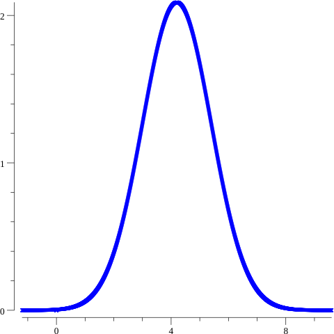

# plot
Go simple-to-use library for plotting and interpreting data, including the Gaussian distribution and Taylor series approximations as well as statistical computations of datasets, vector and matrix visualizations and more.

[](https://godoc.org/github.com/Timothy102/plot)


The plot package is easy to use and it offers a vast ammount of data methods.
You can upload your own dataset to plot or use a dataset with the correspondant output. 
Looking forward to get some feedback!

Let's take a look at some functionality!


  # Installation
  Pretty straightforward. 
  ```go
  go get github.com/timothy102/plot
  ```
  Import the library in your Go file.
  ```go
  import "github.com/timothy102/plot"
  ```


  # Usage
Let's look at a dataset using the cosine function. Second and third argument to the function invoke the starting and end point of iteration. You can adjust the iterations parameter to get a more dense distribution.
```go
points := plot.DefineDataset(math.Cos, -10.0, 10.0, 500)
plot.PlotPoints(points, "Cosine.png", false)
```


That is how simple it is. If you would like to import your dataset externally, use the ReadFromDatafile function.
The rest is the same.

```go
points,err:=plot.ReadFromDatafile(filepath)
//error handling
if err:=PlotPoints(points,"Graph.png",false);err!=nil{
  log.Fatalf("could not plot data :%v",err)
}
```

Taylor series approximation for the Tan function and its error with the real deal.
The last argument indicates the polynomial degree to which the function approximates. 
```go
points := plot.DefineDatasetWithPolynomial(TanEstimate, -2.0, 2.0, 250, 15)
e := EstimationError(math.Tan, points)
fmt.Printf("%.9f\n", e)
```
And the error is: 

```go
0.000000059

```

Taylor series approximation of the 15th degree polynomial of Sine and the difference between Sine.
```go
points := plot.DefineDatasetWithPolynomial(plot.SinusEstimate, -5.0, 5.0, 250, 14)
plot.PlotPoints(points, "SinusEstimate.png", false)

p2 := plot.DefineDataset(math.Sin, -5.0, 5.0, 250)
plot.PlotPoints(p2, "Sinus.png", false)
	
e := plot.ErrorBetweenPoints(points, p2)
fmt.Printf("%.7f", e)

```

 

With an average error of: 
```go
0.0000085
```

Let's take a look at creating a random dataset and then normalizing it so the data is centered and it has the standard deviation of 1
The DefineRandomPoints creates a 1000 points between 0 and 10. 
```go
pts := plot.DefineRandomPoints(1000, 0.0, 10.0)
pts = plot.Normalize(pts)
plot.PlotPoints(pts, "RandomPoints.png", true)
```
 


And finally, the Gaussian distribution.
First parameter is the mean value, the second is the standard deviation and the third is the number of iterations. Adjust these parameters for experimentation.
```go
PlotGaussian(4.2,1.2,1000)
```



